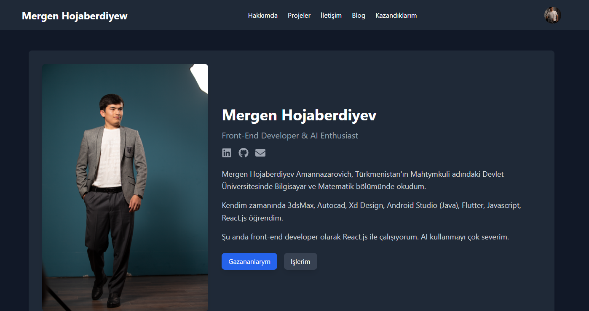

# Portfolio Web

Bu proje, [Create React App](https://github.com/facebook/create-react-app) ile başlatılmış bir React.js portföy web sitesidir.

## Proje Görüntüleri




## Başlarken

Bu talimatlar, yerel makinenizde projeyi nasıl çalıştıracağınızı ve geliştirici modunda nasıl çalışacağınızı açıklar.

### Gereksinimler

- [Node.js](https://nodejs.org/en/) (v14.0.0 veya üstü)
- [npm](https://www.npmjs.com/) (v6.0.0 veya üstü)

### Kurulum

Proje dizinine gidin ve gerekli paketleri yükleyin:

```sh
npm install
```
